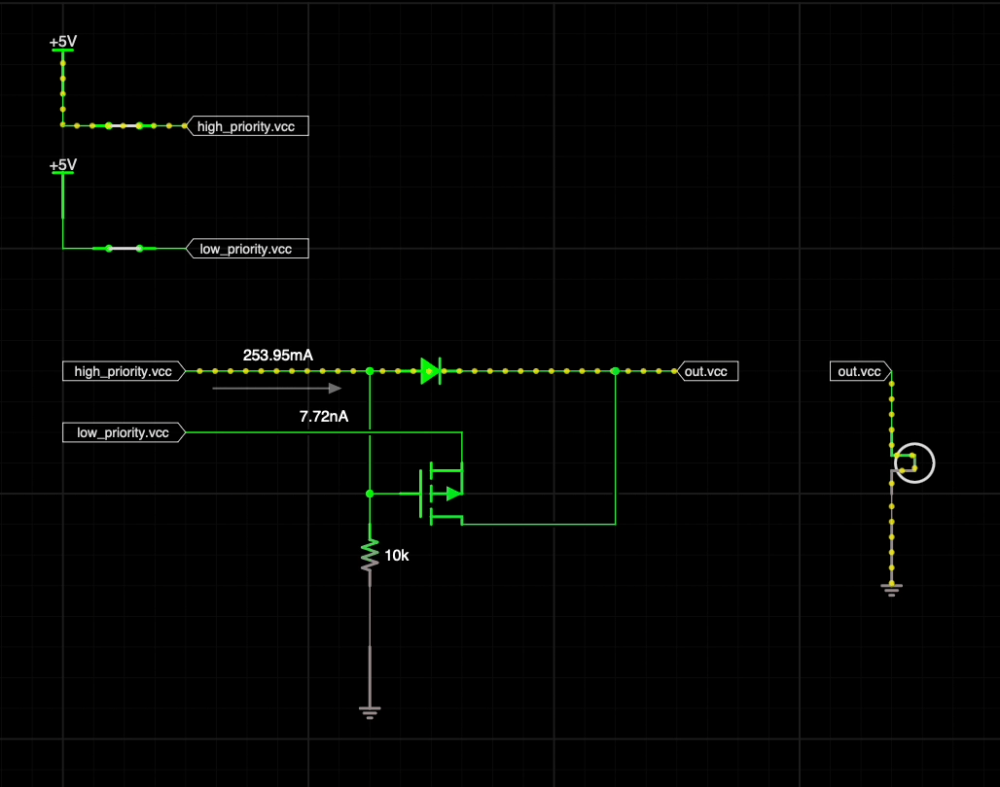
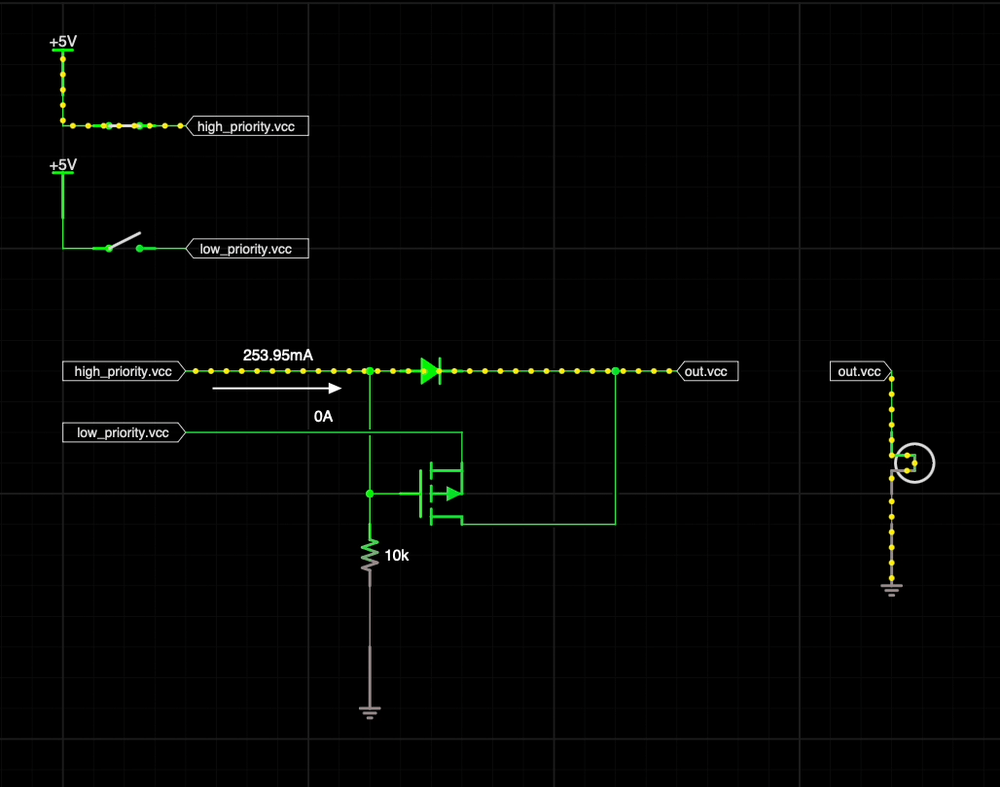
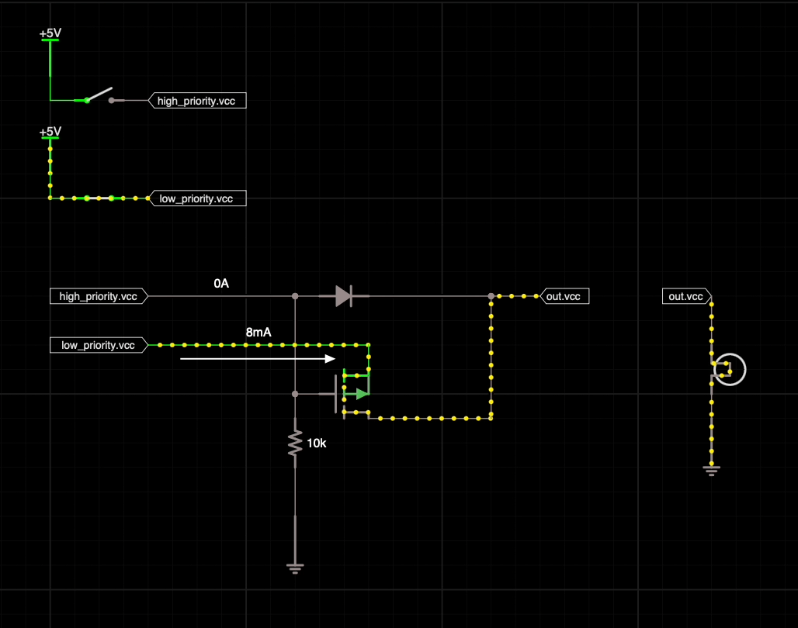

# Power Prioritiser ⚡️

A simple circuit to prioritise a power source over another.

This is useful for situations like a USB-charged battery operated device, where you also want it to work when connected over just USB power.

Often, cheap (and annoyingly expensive) devices neglect this circuit and shutdown when connected over USB. I find this infuriating!

This is better than merely pulling power through the charger circuit because often the inrush currents of a circuit will overwhelm the charger IC and cause it to shut down. This can even lead in the nastiest cases to a boot-loop where the device never charges from a 0% battery.

It's better than a diode because it can handle high-voltage low-priority sources than high and it doesn't have a voltage drop over the low-priority source (typically a battery).

## Limitations

Currently, the components for this circuit are bespokely selected, and aren't parametised for majorly different voltages and currents. It's designed for a USB charged, 1S LiPo powered device.

## Usage

Simple! Hook up `high_priority` and `low_priority` to your power sources, and `out` to your device.

## How it works

When the high-priority power source is connected, the P-FET's gate is pulled high, turning it off. The P-FET thereby stops the low-priority power source from powering the device, even if it's voltage is higher than the high-priority source.

### Both sources connected

### High-priority source only

### Low-priority source only

